<picture>
  <source media="(prefers-color-scheme: dark)" srcset="./profile/github-snake-dark.svg" />
  <source media="(prefers-color-scheme: light)" srcset="./profile/github-snake.svg" />
  
</picture>

